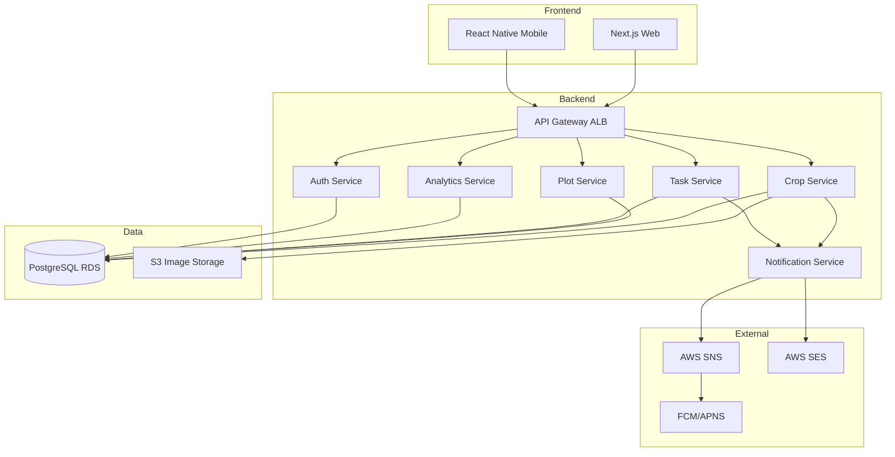
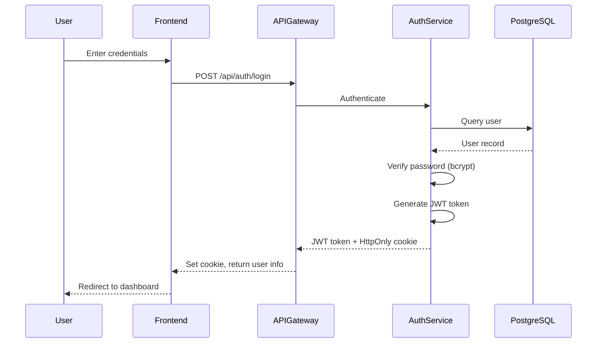
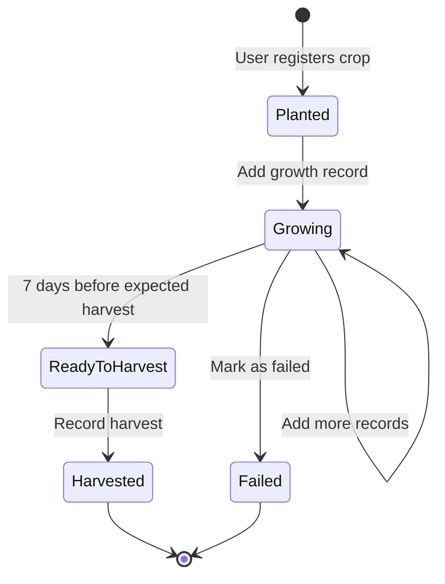
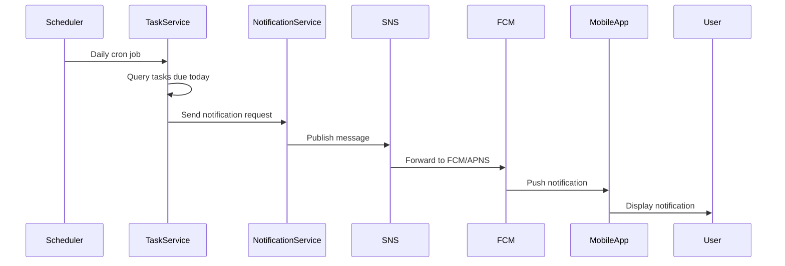

# Technical Design Document: 家庭菜園管理アプリケーション

## Overview

本アプリケーションは、家庭菜園での作物栽培を効率的に管理するためのWebおよびモバイルアプリケーションです。モノレポ方式を採用し、フロントエンド（React Native/TypeScript/Next.js）、バックエンド（Go/Echo）、インフラコード（Terraform）を統合的に管理します。

**Purpose**: ユーザーが作物の植え付けから収穫までのライフサイクルを記録し、菜園区画を視覚的に管理し、栽培タスクをスケジュール・追跡し、栽培データを分析できるプラットフォームを提供する。

**Users**:
- 家庭菜園利用者（プライマリーユーザー）: 作物管理、タスク管理、記録・分析を実行
- 開発チーム: モノレポ環境で効率的に開発・デプロイを実施

**Impact**: 現在手動で管理している栽培記録をデジタル化し、データ分析による栽培技術の向上を実現する。

### Goals

- 作物の植え付けから収穫までの完全なライフサイクル記録
- 菜園区画の視覚的レイアウト管理と作物配置
- 水やり・施肥などの栽培タスクの自動リマインダー
- 収穫量データのグラフ可視化と分析機能
- マルチデバイス対応（Webブラウザ + iOS/Androidアプリ）
- AWS上でのスケーラブルなインフラ構成
- Terraformによる完全なIaC（Infrastructure as Code）管理

### Non-Goals

- 作物の自動識別AI機能（将来の拡張候補）
- 他ユーザーとのSNS機能・コミュニティ機能
- IoTデバイス統合（温度センサー、土壌湿度センサー等）
- オフライン完全動作（一部キャッシュのみ実装）
- eコマース機能（種子・肥料の販売）

## Architecture

> 詳細な調査ノートは`research.md`に記録されているが、設計判断と契約は本ドキュメントで完結する。

### Architecture Pattern & Boundary Map

**選定パターン**: Clean Architecture ベースの Layered Architecture (Repository Pattern)

**理由**:
- Goエコシステムで標準的なパターン
- テスト容易性が高い（Repository層をモック可能）
- ビジネスロジックとデータ層の疎結合を実現
- 将来のマイクロサービス化への移行パスが明確

**Domain/Feature Boundaries**:
- **User Domain**: 認証・認可、ユーザープロファイル管理
- **Crop Domain**: 作物登録、成長記録、収穫記録
- **Plot Domain**: 菜園区画管理、作物配置
- **Task Domain**: タスク作成、スケジュール、完了管理
- **Analytics Domain**: データ集計、グラフ生成、エクスポート
- **Notification Domain**: プッシュ通知、メール通知



**Existing Patterns Preserved**: N/A（新規プロジェクト）

**New Components Rationale**:
- 各ドメインサービスを独立したコンポーネントとして設計し、並列実装を可能に
- Repository patternで将来的なデータストア変更に対応
- Notification Serviceを分離し、複数チャネル（SNS, SES）を統一インターフェースで管理

**Steering Compliance**: ステアリングディレクトリが未設定のため、業界標準ベストプラクティスに準拠

### Technology Stack

| Layer | Choice / Version | Role in Feature | Notes |
|-------|------------------|-----------------|-------|
| **Frontend - Web** | Next.js 15.x, React 19.x, TypeScript 5.x | Webアプリケーション、SSR対応 | App Router使用、Tailwind CSS |
| **Frontend - Mobile** | React Native 0.76.x, Expo SDK 52 | iOS/Androidアプリ | Expo Managed Workflow |
| **Backend** | Go 1.23+, Echo v4, GORM v2 | RESTful API, ビジネスロジック | echo-jwt v4でJWT認証 |
| **Data - Primary** | PostgreSQL 16.x on RDS | メインデータストア | Multi-AZ構成 |
| **Data - Object Storage** | AWS S3 | 作物画像、CSVエクスポート | CloudFront CDN連携 |
| **Messaging - Push** | AWS SNS + FCM/APNS | モバイルプッシュ通知 | React Native Firebase統合 |
| **Messaging - Email** | AWS SES | メール通知 | トランザクションメール専用 |
| **Infrastructure** | Terraform 1.9+, Docker, AWS ECS Fargate | IaC管理、コンテナデプロイ | GitHub Actionsで自動化 |
| **Build System** | Turborepo 2.x, pnpm 9.x | モノレポビルド、依存関係管理 | キャッシュ機構活用 |

> 選定根拠の詳細は`research.md`の「Design Decisions」セクションを参照。主要な判断:
> - Turborepo: 高速ビルド、学習コスト低、10分で導入可能
> - PostgreSQL: 複雑クエリ、JSONB対応、データ整合性
> - Go Echo: 高速、軽量、JWT公式サポート
> - ECS Fargate: サーバーレス、自動スケーリング、運用コスト削減

## System Flows

### User Authentication Flow



**Key Decisions**:
- JWT格納にHttpOnly cookieを使用してXSS攻撃を防御
- パスワードハッシュにbcrypt使用（コスト係数12）
- トークン有効期限24時間、リフレッシュトークンで延長

### Crop Lifecycle Management Flow



### Push Notification Flow



## Requirements Traceability

| Requirement | Summary | Components | Interfaces | Flows |
|-------------|---------|------------|------------|-------|
| 1.1 | 作物新規登録 | CropService | POST /api/crops | Crop Lifecycle |
| 1.2 | 成長記録追加 | CropService | POST /api/crops/:id/records | Crop Lifecycle |
| 1.3 | 収穫記録 | CropService | POST /api/crops/:id/harvest | Crop Lifecycle |
| 1.4 | 成長履歴表示 | CropService | GET /api/crops/:id/records | - |
| 1.5 | 収穫準備通知 | NotificationService, CropService | EventBus | Push Notification |
| 2.1 | 区画新規登録 | PlotService | POST /api/plots | - |
| 2.2 | 作物配置 | PlotService | POST /api/plots/:id/assign | - |
| 2.3 | レイアウトグリッド表示 | PlotService, Frontend | GET /api/plots/layout | - |
| 2.4 | 区画使用履歴 | PlotService | GET /api/plots/:id/history | - |
| 2.5 | 重複配置防止 | PlotService | Business logic | - |
| 3.1 | タスク作成 | TaskService | POST /api/tasks | - |
| 3.2 | 今日のタスク表示 | TaskService | GET /api/tasks/today | - |
| 3.3 | タスク完了 | TaskService | PUT /api/tasks/:id/complete | - |
| 3.4 | タスクソート表示 | TaskService | GET /api/tasks | - |
| 3.5 | 期限切れハイライト | Frontend | UI logic | - |
| 3.6 | 繰り返しタスク自動生成 | TaskService | Background job | - |
| 4.1 | 収穫量集計 | AnalyticsService | GET /api/analytics/harvest | - |
| 4.2 | グラフ可視化 | AnalyticsService, Frontend | GET /api/analytics/charts | - |
| 4.3 | 栽培記録一覧 | CropService | GET /api/crops/:id/records | - |
| 4.4 | 区画生産性表示 | AnalyticsService | GET /api/analytics/plots | - |
| 4.5 | CSVエクスポート | AnalyticsService | GET /api/analytics/export | - |
| 5.1 | 当日タスク通知 | NotificationService | EventBus | Push Notification |
| 5.2 | 収穫準備通知 | NotificationService | EventBus | Push Notification |
| 5.3 | 成長記録追加時通知 | NotificationService | EventBus | Push Notification |
| 5.4 | 通知設定カスタマイズ | AuthService | PUT /api/users/settings | - |
| 5.5 | 期限切れタスク警告 | NotificationService | Background job | Push Notification |
| 6.1 | ユーザー新規登録 | AuthService | POST /api/auth/register | User Authentication |
| 6.2 | ユーザーログイン | AuthService | POST /api/auth/login | User Authentication |
| 6.3 | データ分離 | All Services | Row-level security | - |
| 6.4 | パスワードハッシュ化 | AuthService | bcrypt | - |
| 6.5 | ログアウト | AuthService | POST /api/auth/logout | - |
| 6.6 | ログイン失敗ロック | AuthService | Business logic | - |
| 7.1 | モノレポ構造 | Build System | Turborepo config | - |
| 7.2 | パッケージ管理 | Build System | pnpm workspace | - |
| 7.3 | Terraformインフラ管理 | Infrastructure | Terraform modules | - |
| 7.4 | Dockerコンテナ化 | Backend | Dockerfile, ECS | - |
| 7.5 | CI/CDパイプライン | DevOps | GitHub Actions | - |
| 7.6 | コードリンター・フォーマッター | Build System | ESLint, Prettier, gofmt | - |
| 7.7 | 機密情報管理 | Infrastructure | AWS Secrets Manager | - |

## Components and Interfaces

### Summary Table

| Component | Domain/Layer | Intent | Req Coverage | Key Dependencies (Criticality) | Contracts |
|-----------|--------------|--------|--------------|-------------------------------|-----------|
| AuthService | Backend/User | ユーザー認証・認可 | 6.1-6.6 | PostgreSQL (P0), JWT (P0) | Service, API |
| CropService | Backend/Crop | 作物ライフサイクル管理 | 1.1-1.5, 4.3 | PostgreSQL (P0), S3 (P1), NotificationService (P1) | Service, API, Event |
| PlotService | Backend/Plot | 菜園区画管理 | 2.1-2.5 | PostgreSQL (P0) | Service, API |
| TaskService | Backend/Task | タスクスケジュール管理 | 3.1-3.6 | PostgreSQL (P0), NotificationService (P1) | Service, API, Event |
| AnalyticsService | Backend/Analytics | データ集計・分析 | 4.1-4.5 | PostgreSQL (P0), S3 (P1) | Service, API |
| NotificationService | Backend/Notification | 通知配信 | 5.1-5.5 | SNS (P0), SES (P1), DynamoDB (P0) | Service, Event |
| WebApp | Frontend/Web | Next.js Webアプリ | All UI | API Gateway (P0) | API Client |
| MobileApp | Frontend/Mobile | React Native モバイルアプリ | All UI | API Gateway (P0), Firebase (P0) | API Client |

### Backend / User Domain

#### AuthService

| Field | Detail |
|-------|--------|
| Intent | ユーザー登録、ログイン、JWT発行、セッション管理 |
| Requirements | 6.1, 6.2, 6.3, 6.4, 6.5, 6.6 |

**Responsibilities & Constraints**:
- ユーザー認証情報の検証
- JWTトークンの生成・検証
- パスワードのハッシュ化（bcrypt, cost 12）
- ログイン失敗回数の追跡とアカウントロック
- トランザクション境界: 単一ユーザーレコード操作

**Dependencies**:
- Inbound: API Gateway — HTTP requests (P0)
- Outbound: PostgreSQL — User table CRUD (P0)
- External: echo-jwt v4 — JWT middleware (P0), bcrypt — Password hashing (P0)

**Contracts**: [x] Service [ x] API [ ] Event [ ] Batch [ ] State

##### Service Interface

```typescript
interface AuthService {
  register(req: RegisterRequest): Result<User, AuthError>;
  login(req: LoginRequest): Result<AuthResponse, AuthError>;
  logout(userID: string): Result<void, AuthError>;
  verifyToken(token: string): Result<User, AuthError>;
  incrementFailedLogin(email: string): Result<void, AuthError>;
  resetFailedLogin(email: string): Result<void, AuthError>;
}

type RegisterRequest = {
  email: string;
  password: string;
  username: string;
};

type LoginRequest = {
  email: string;
  password: string;
};

type AuthResponse = {
  user: User;
  token: string;
  expiresAt: string;
};

type AuthError =
  | { type: "InvalidCredentials" }
  | { type: "AccountLocked" }
  | { type: "UserAlreadyExists" }
  | { type: "InvalidToken" };
```

- **Preconditions**: メールアドレス形式検証、パスワード強度検証
- **Postconditions**: JWTトークン有効期限24時間、ログイン失敗3回でアカウント30分ロック
- **Invariants**: パスワードは必ずハッシュ化して保存、トークンはHttpOnly cookieに格納

##### API Contract

| Method | Endpoint | Request | Response | Errors |
|--------|----------|---------|----------|--------|
| POST | /api/auth/register | RegisterRequest | User | 400, 409, 500 |
| POST | /api/auth/login | LoginRequest | AuthResponse + Set-Cookie | 400, 401, 423, 500 |
| POST | /api/auth/logout | - | - | 401, 500 |
| GET | /api/auth/me | - | User | 401, 500 |

**Implementation Notes**:
- **Integration**: echo-jwtミドルウェアで全APIエンドポイントをJWT保護
- **Validation**: email形式（RFC 5322）、password最小8文字・大小英数記号含む
- **Token Revocation**: PostgreSQLベースのトークンブラックリスト実装、ログアウト時にトークンハッシュを保存（TTL 24時間で定期削除）

### Backend / Crop Domain

#### CropService

| Field | Detail |
|-------|--------|
| Intent | 作物の登録、成長記録、収穫記録、画像アップロード管理 |
| Requirements | 1.1, 1.2, 1.3, 1.4, 1.5, 4.3 |

**Responsibilities & Constraints**:
- 作物マスタデータ管理（名前、品種、植え付け日、予想収穫日）
- 成長記録の追加（日付、成長段階、メモ、写真）
- 収穫記録（日付、収穫量、品質評価）
- 画像のS3アップロード・取得
- 収穫7日前の通知イベント発行
- トランザクション境界: 単一作物またはその成長記録

**Dependencies**:
- Inbound: API Gateway — HTTP requests (P0)
- Outbound: PostgreSQL — Crop, GrowthRecord, Harvest tables (P0)
- Outbound: S3 — Image upload/download (P1)
- Outbound: NotificationService — Harvest reminder events (P1)

**Contracts**: [x] Service [x] API [x] Event [ ] Batch [ ] State

##### Service Interface

```typescript
interface CropService {
  createCrop(req: CreateCropRequest): Result<Crop, CropError>;
  addGrowthRecord(cropID: string, req: GrowthRecordRequest): Result<GrowthRecord, CropError>;
  recordHarvest(cropID: string, req: HarvestRequest): Result<Harvest, CropError>;
  getCrop(cropID: string): Result<Crop, CropError>;
  listCrops(filter: CropFilter): Result<Crop[], CropError>;
  getGrowthRecords(cropID: string): Result<GrowthRecord[], CropError>;
  uploadImage(file: File): Result<ImageURL, CropError>;
}

type CreateCropRequest = {
  name: string;
  variety: string;
  plantedDate: Date;
  expectedHarvestDate: Date;
  plotID?: string;
};

type GrowthRecordRequest = {
  recordDate: Date;
  growthStage: "Seedling" | "Vegetative" | "Flowering" | "Fruiting";
  notes: string;
  imageURL?: string;
};

type HarvestRequest = {
  harvestDate: Date;
  quantity: number;
  quantityUnit: "kg" | "g" | "pieces";
  quality: "Excellent" | "Good" | "Fair" | "Poor";
};

type CropError =
  | { type: "CropNotFound" }
  | { type: "InvalidDate" }
  | { type: "ImageUploadFailed" }
  | { type: "PlotOccupied" };
```

- **Preconditions**: plantedDate <= expectedHarvestDate, quantity > 0
- **Postconditions**: 収穫記録時にステータスを"Harvested"に更新、収穫7日前に通知イベント発行
- **Invariants**: 作物は必ずユーザーIDに紐付く、削除は論理削除（deleted_at）

##### API Contract

| Method | Endpoint | Request | Response | Errors |
|--------|----------|---------|----------|--------|
| POST | /api/crops | CreateCropRequest | Crop | 400, 409, 500 |
| POST | /api/crops/:id/records | GrowthRecordRequest | GrowthRecord | 400, 404, 500 |
| POST | /api/crops/:id/harvest | HarvestRequest | Harvest | 400, 404, 500 |
| GET | /api/crops/:id | - | Crop | 404, 500 |
| GET | /api/crops | CropFilter (query params) | Crop[] | 400, 500 |
| GET | /api/crops/:id/records | - | GrowthRecord[] | 404, 500 |
| POST | /api/crops/images | multipart/form-data | ImageURL | 400, 413, 500 |

##### Event Contract

- **Published events**:
  - `CropHarvestReminder`: 収穫7日前に発行、NotificationServiceが購読
  - `GrowthRecordAdded`: 成長記録追加時に発行（オプション通知）
- **Subscribed events**: なし
- **Ordering / delivery guarantees**: At-least-once delivery (SNS/SQS)

**Implementation Notes**:
- **Integration**: S3署名付きURL生成（presigned URL, 15分有効）、CloudFront CDN経由で画像配信
- **Validation**: 画像ファイルサイズ上限5MB、形式JPEG/PNG/WEBP
- **Retry**: Exponential backoff付きリトライ機構（初回1秒、最大3回、AWS SDK組み込みリトライ活用）

### Backend / Plot Domain

#### PlotService

| Field | Detail |
|-------|--------|
| Intent | 菜園区画の登録、作物配置、レイアウト管理 |
| Requirements | 2.1, 2.2, 2.3, 2.4, 2.5 |

**Responsibilities & Constraints**:
- 区画マスタデータ管理（名前、サイズ、土壌タイプ、日当たり）
- 作物の区画配置と重複チェック
- 区画レイアウトのグリッド表示データ生成
- 区画使用履歴の記録
- トランザクション境界: 単一区画または配置操作

**Dependencies**:
- Inbound: API Gateway — HTTP requests (P0)
- Outbound: PostgreSQL — Plot, PlotAssignment tables (P0)

**Contracts**: [x] Service [x] API [ ] Event [ ] Batch [ ] State

##### Service Interface

```typescript
interface PlotService {
  createPlot(req: CreatePlotRequest): Result<Plot, PlotError>;
  assignCrop(plotID: string, cropID: string): Result<PlotAssignment, PlotError>;
  unassignCrop(plotID: string): Result<void, PlotError>;
  getPlot(plotID: string): Result<Plot, PlotError>;
  listPlots(): Result<Plot[], PlotError>;
  getPlotLayout(): Result<PlotLayout, PlotError>;
  getPlotHistory(plotID: string): Result<PlotHistory[], PlotError>;
}

type CreatePlotRequest = {
  name: string;
  width: number;
  height: number;
  soilType: "Loam" | "Clay" | "Sandy" | "Silt";
  sunlight: "Full" | "Partial" | "Shade";
  positionX?: number;
  positionY?: number;
};

type PlotLayout = {
  plots: Array<{
    id: string;
    name: string;
    x: number;
    y: number;
    width: number;
    height: number;
    status: "Available" | "Occupied";
    crop?: Crop;
  }>;
};

type PlotError =
  | { type: "PlotNotFound" }
  | { type: "PlotOccupied" }
  | { type: "CropNotFound" };
```

- **Preconditions**: width > 0, height > 0, cropID存在確認
- **Postconditions**: 配置時にstatusを"Occupied"に更新、配置解除時に"Available"に戻す
- **Invariants**: 1区画に1作物のみ配置可能（重複配置防止）

##### API Contract

| Method | Endpoint | Request | Response | Errors |
|--------|----------|---------|----------|--------|
| POST | /api/plots | CreatePlotRequest | Plot | 400, 500 |
| POST | /api/plots/:id/assign | { cropID: string } | PlotAssignment | 400, 404, 409, 500 |
| DELETE | /api/plots/:id/assign | - | - | 404, 500 |
| GET | /api/plots/:id | - | Plot | 404, 500 |
| GET | /api/plots | - | Plot[] | 500 |
| GET | /api/plots/layout | - | PlotLayout | 500 |
| GET | /api/plots/:id/history | - | PlotHistory[] | 404, 500 |

**Implementation Notes**:
- **Integration**: フロントエンドでグリッドレイアウト表示（React DnD等）
- **Validation**: 区画重複チェック（positionX, positionY, width, heightで衝突検出）
- **Risks**: 大規模菜園（100+区画）でのレイアウト描画パフォーマンス低下

### Backend / Task Domain

#### TaskService

| Field | Detail |
|-------|--------|
| Intent | 栽培タスクの作成、スケジュール管理、完了追跡 |
| Requirements | 3.1, 3.2, 3.3, 3.4, 3.5, 3.6 |

**Responsibilities & Constraints**:
- タスクマスタデータ管理（名前、予定日、優先度、繰り返し設定）
- 今日のタスク抽出
- タスク完了処理と繰り返しタスクの自動生成
- 期限切れタスクの検出と通知イベント発行
- トランザクション境界: 単一タスク操作

**Dependencies**:
- Inbound: API Gateway — HTTP requests (P0)
- Inbound: Scheduler — Cron job trigger (P0)
- Outbound: PostgreSQL — Task table (P0)
- Outbound: NotificationService — Task reminder events (P1)

**Contracts**: [x] Service [x] API [x] Event [x] Batch [ ] State

##### Service Interface

```typescript
interface TaskService {
  createTask(req: CreateTaskRequest): Result<Task, TaskError>;
  completeTask(taskID: string): Result<Task, TaskError>;
  listTasks(filter: TaskFilter): Result<Task[], TaskError>;
  getTodayTasks(): Result<Task[], TaskError>;
  getOverdueTasks(): Result<Task[], TaskError>;
}

type CreateTaskRequest = {
  name: string;
  description?: string;
  dueDate: Date;
  priority: "High" | "Medium" | "Low";
  cropID?: string;
  plotID?: string;
  recurrence?: {
    frequency: "Daily" | "Weekly" | "Monthly";
    interval: number;
    endCondition: {
      maxOccurrences?: number;  // 最大繰り返し回数（例: 365）
      endDate?: Date;            // 終了日
    };
  };
};

type TaskFilter = {
  status?: "Pending" | "Completed" | "Overdue";
  priority?: "High" | "Medium" | "Low";
  sortBy?: "dueDate" | "priority" | "createdAt";
};

type TaskError =
  | { type: "TaskNotFound" }
  | { type: "InvalidDate" }
  | { type: "CropOrPlotNotFound" };
```

- **Preconditions**: dueDate >= today, recurrence.interval > 0, recurrence.endCondition必須（maxOccurrences または endDate）
- **Postconditions**: 完了時にstatusを"Completed"に更新、繰り返し設定がある場合は次回タスクを自動生成（終了条件に達するまで）
- **Invariants**: タスクは必ずユーザーIDに紐付く、削除は論理削除

##### API Contract

| Method | Endpoint | Request | Response | Errors |
|--------|----------|---------|----------|--------|
| POST | /api/tasks | CreateTaskRequest | Task | 400, 404, 500 |
| PUT | /api/tasks/:id/complete | - | Task | 404, 500 |
| GET | /api/tasks | TaskFilter (query params) | Task[] | 400, 500 |
| GET | /api/tasks/today | - | Task[] | 500 |
| GET | /api/tasks/overdue | - | Task[] | 500 |

##### Event Contract

- **Published events**:
  - `TaskDueReminder`: 当日タスクの通知イベント
  - `TaskOverdueAlert`: 期限切れタスク3件以上で警告イベント
- **Subscribed events**: なし

##### Batch / Job Contract

- **Trigger**: 毎日 6:00 AM (UTC) cron job
- **Input / validation**: ユーザーごとの当日タスクと期限切れタスクを抽出
- **Output / destination**: NotificationServiceへイベント発行
- **Idempotency & recovery**: 同一タスクIDで重複通知を防止（DynamoDB TTLで24時間キャッシュ）

**Implementation Notes**:
- **Integration**: AWS EventBridge SchedulerでDaily cron job実行
- **Validation**: タスク作成時にcropIDまたはplotIDの存在確認、繰り返し設定時はendCondition必須
- **Recurrence**: 繰り返しタスク生成時にmaxOccurrencesまたはendDateをチェック、終了条件到達時は生成停止

### Backend / Analytics Domain

#### AnalyticsService

| Field | Detail |
|-------|--------|
| Intent | 栽培データの集計、グラフデータ生成、CSVエクスポート |
| Requirements | 4.1, 4.2, 4.3, 4.4, 4.5 |

**Responsibilities & Constraints**:
- 作物ごとの総収穫量・平均成長期間の集計
- 月別・作物別の収穫量グラフデータ生成
- 区画ごとの生産性計算（収穫量/面積）
- CSVエクスポート生成とS3保存
- トランザクション境界: 読み取り専用クエリ

**Dependencies**:
- Inbound: API Gateway — HTTP requests (P0)
- Outbound: PostgreSQL — Read-only queries (P0)
- Outbound: S3 — CSV file upload (P1)

**Contracts**: [x] Service [x] API [ ] Event [ ] Batch [ ] State

##### Service Interface

```typescript
interface AnalyticsService {
  getHarvestSummary(filter: AnalyticsFilter): Result<HarvestSummary, AnalyticsError>;
  getChartData(chartType: ChartType, filter: AnalyticsFilter): Result<ChartData, AnalyticsError>;
  getPlotProductivity(): Result<PlotProductivity[], AnalyticsError>;
  exportCSV(dataType: ExportDataType): Result<ExportURL, AnalyticsError>;
}

type AnalyticsFilter = {
  startDate?: Date;
  endDate?: Date;
  cropID?: string;
  plotID?: string;
};

type ChartType = "MonthlyHarvest" | "CropComparison" | "PlotProductivity";

type HarvestSummary = {
  totalQuantity: number;
  averageGrowthDays: number;
  cropCount: number;
  byCrop: Array<{
    cropName: string;
    totalQuantity: number;
    harvestCount: number;
  }>;
};

type ChartData = {
  labels: string[];
  datasets: Array<{
    label: string;
    data: number[];
  }>;
};

type PlotProductivity = {
  plotID: string;
  plotName: string;
  area: number;
  totalHarvest: number;
  productivity: number; // kg/m²
};

type ExportDataType = "Crops" | "Harvests" | "Tasks" | "All";

type AnalyticsError =
  | { type: "InsufficientData" }
  | { type: "ExportFailed" };
```

- **Preconditions**: startDate <= endDate
- **Postconditions**: CSVファイル生成後、S3に署名付きURL（1時間有効）を返す
- **Invariants**: 集計クエリは読み取り専用、書き込み操作なし

##### API Contract

| Method | Endpoint | Request | Response | Errors |
|--------|----------|---------|----------|--------|
| GET | /api/analytics/harvest | AnalyticsFilter (query) | HarvestSummary | 400, 500 |
| GET | /api/analytics/charts/:type | AnalyticsFilter (query) | ChartData | 400, 500 |
| GET | /api/analytics/plots | - | PlotProductivity[] | 500 |
| GET | /api/analytics/export/:dataType | - | ExportURL | 400, 500 |

**Implementation Notes**:
- **Integration**: PostgreSQL Materialized Viewで集計クエリを高速化、毎日深夜にリフレッシュ
- **Validation**: 大量データ（10,000+レコード）の場合はページネーション推奨
- **Risks**: 複雑な集計クエリでパフォーマンス低下、インデックス最適化が必要

### Backend / Notification Domain

#### NotificationService

| Field | Detail |
|-------|--------|
| Intent | プッシュ通知とメール通知の統一配信 |
| Requirements | 5.1, 5.2, 5.3, 5.4, 5.5 |

**Responsibilities & Constraints**:
- デバイストークンの管理（DynamoDB）
- AWS SNS経由でモバイルプッシュ通知配信
- AWS SES経由でメール通知配信
- ユーザー通知設定の反映
- トランザクション境界: 単一通知イベント処理

**Dependencies**:
- Inbound: CropService, TaskService — Event subscription (P0)
- Outbound: AWS SNS — Push notification (P0)
- Outbound: AWS SES — Email notification (P1)
- Outbound: DynamoDB — Device token storage (P0)

**Contracts**: [x] Service [ ] API [x] Event [ ] Batch [ ] State

##### Service Interface

```typescript
interface NotificationService {
  registerDeviceToken(userID: string, token: DeviceToken): Result<void, NotificationError>;
  sendPushNotification(req: PushNotificationRequest): Result<void, NotificationError>;
  sendEmail(req: EmailRequest): Result<void, NotificationError>;
  updateUserSettings(userID: string, settings: NotificationSettings): Result<void, NotificationError>;
}

type DeviceToken = {
  token: string;
  platform: "iOS" | "Android";
};

type PushNotificationRequest = {
  userID: string;
  title: string;
  body: string;
  data?: Record<string, string>;
};

type EmailRequest = {
  to: string;
  subject: string;
  body: string;
  templateID?: string;
};

type NotificationSettings = {
  pushEnabled: boolean;
  emailEnabled: boolean;
  taskReminders: boolean;
  harvestReminders: boolean;
  growthRecordNotifications: boolean;
};

type NotificationError =
  | { type: "InvalidToken" }
  | { type: "DeliveryFailed" }
  | { type: "UserOptedOut" };
```

- **Preconditions**: デバイストークンの有効性検証
- **Postconditions**: ユーザー設定で無効化されている場合は通知スキップ
- **Invariants**: 同一通知の重複送信を防止（24時間TTL）

##### Event Contract

- **Published events**: なし
- **Subscribed events**:
  - `CropHarvestReminder` (from CropService)
  - `TaskDueReminder` (from TaskService)
  - `TaskOverdueAlert` (from TaskService)
  - `GrowthRecordAdded` (from CropService, オプション)
- **Ordering / delivery guarantees**: At-least-once delivery via SNS/SQS

**Implementation Notes**:
- **Integration**: React Native Firebaseでデバイストークン取得、ログイン/アプリ起動時にregisterDeviceToken API呼び出し
- **Validation**: AWS SNSのPlatform Application設定（FCM Server Key, APNS Certificate）
- **Retry**: SNS/SES配信失敗時のExponential backoff付きリトライ（初回1秒、最大3回）、無効トークン検出時は自動削除

### Frontend / Web

#### WebApp (Next.js)

| Field | Detail |
|-------|--------|
| Intent | WebブラウザでのUIレンダリング、APIクライアント、SSR対応 |
| Requirements | All UI requirements |

**Responsibilities & Constraints**:
- Next.js App Routerによるページルーティング
- サーバーサイドレンダリング（SSR）とクライアントサイドレンダリング（CSR）の最適化
- Tailwind CSSによるレスポンシブUI
- APIクライアント（Fetch API + React Query）
- JWT認証状態管理（Zustand）

**Dependencies**:
- Outbound: API Gateway — RESTful API calls (P0)
- External: Next.js 15.x, React 19.x, Tailwind CSS, React Query, Zustand

**Contracts**: [ ] Service [x] API [ ] Event [ ] State

**Implementation Notes**:
- **Integration**: API GatewayへのリクエストにJWT cookieを自動付与
- **Validation**: クライアント側フォームバリデーション（React Hook Form + Zod）
- **Risks**: SSRでのJWT取得（Next.js middlewareでcookie読み取り）

### Frontend / Mobile

#### MobileApp (React Native)

| Field | Detail |
|-------|--------|
| Intent | iOS/Androidアプリ、プッシュ通知受信、オフラインキャッシュ |
| Requirements | All UI requirements + 5.1-5.5 |

**Responsibilities & Constraints**:
- React Navigationによる画面遷移
- React Native Firebaseでプッシュ通知受信
- AsyncStorageによるオフラインキャッシュ
- APIクライアント（Axios + React Query）

**Dependencies**:
- Outbound: API Gateway — RESTful API calls (P0)
- External: React Native 0.76, Expo SDK 52, React Native Firebase, React Navigation

**Contracts**: [ ] Service [x] API [ ] Event [ ] State

**Implementation Notes**:
- **Integration**: Expo Managed Workflowで両プラットフォームビルド、EAS Build使用
- **Validation**: プッシュ通知パーミッション取得（初回起動時）
- **Risks**: iOS APNs証明書の有効期限管理、FCM Server Keyのローテーション

